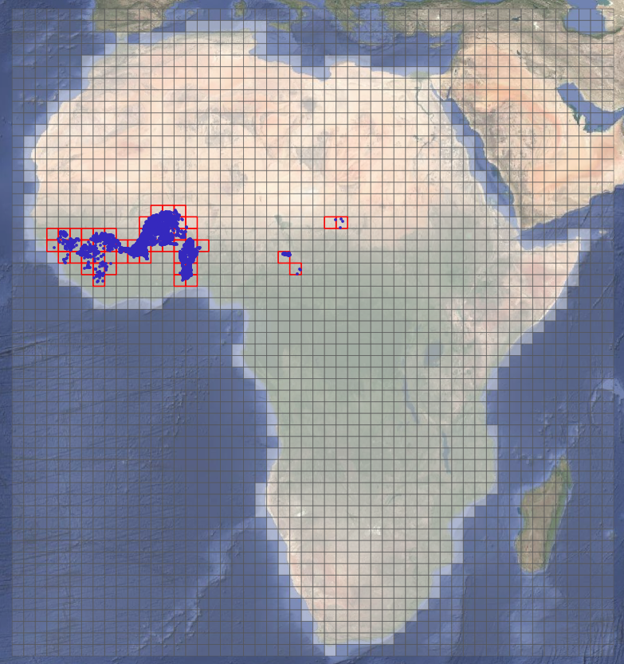

## 1. Project Overview

This project aims to leverage geospatial (GIS) and climatic data to develop a tool based on machine learning modeling to assess the static depth to water (DTW) in crystalline basement aquifers of Africa. Accurate water table depth predictions are crucial for sustainable water resource management, especially in regions dependent on rainfed agriculture.

The model is trained using one-time measurements of water table depth in the following countries: Benin, Burkina Faso, Guinea, Mali, Niger, Togo, TChad

The training data includes:
- Climatic variables (daily precipitation and NDVI).
- Topographic and hydrological features derived from Digital Elevation Models (DEMs) and GIS analysis.

## 2. Installation Instructions

These instructions use graphical interfaces (Anaconda Navigator and GitHub Desktop) for ease of use.

> [!NOTE]
> If you prefer using command-line tools, you can use `git clone`, `conda env create -f environment.yml`, and standard conda/pip commands. The repository includes an `environment.yml` file with all dependencies.

### Prerequisites

1. **Anaconda** (full distribution, includes Navigator)
   - Download: https://www.anaconda.com/download
   - Install with default options
   - **Important:** Use a recent version (2023 or newer recommended)

2. **GitHub Desktop**
   - Download: https://desktop.github.com/
   - Install and sign in with your GitHub account (create one if needed)

3. **NASA EarthData Account** (free, required for downloading satellite data)
   - Sign up: https://urs.earthdata.nasa.gov/
   
### Step 1: Clone the Repository with GitHub Desktop

1. Open **GitHub Desktop**
2. Click **File** → **Clone repository**
3. Click the **URL** tab
4. Enter repository URL: `https://github.com/geo-stack/hydrodepthml`
5. Choose a local path (e.g., `C:\Users\YourName\Documents\hydrodepthml`)
6. Click **Clone**
7. Wait for the download to complete (may take a few minutes due to large files)

### Step 2: Create Environment with Anaconda Navigator

1. Open **Anaconda Navigator**
2. Click **Environments** (left sidebar)
3. Click **Import** (bottom of environment list)
4. In the dialog:
   - **Name**: `hydrodepthml`
   - Click the 📁 folder icon next to "Specification file"
   - Navigate to where you cloned the repository
   - Select `environment.yml`
5. Click **Import**
6. Wait for installation (10-20 minutes depending on your internet connection)

> **Note:** This will automatically install all required packages, including those from pip (whitebox, appconfigs).

> **If import fails:** This usually means Anaconda Navigator is outdated or there's a network issue. Try:
> - Update Anaconda Navigator: **Help** → **Check for Updates**
> - Check your internet connection
> - Or use the command-line method (see note at top)

### Step 3: Install the hydrodepthml Package

1. In **Anaconda Navigator**, with `hydrodepthml` environment selected
2. Click the ▶️ (play button) next to `hydrodepthml`
3. Select **Open Terminal**
4. Navigate to the repository and install:

   ```bash
   cd "path_to_your_cloned_repository"
   pip install -e .
   ```
   
   > **Note:** Replace `path_to_your_cloned_repository` with the actual path where you cloned the repository in Step 1.

## 3. Storage Requirements

| Data Type | Peak Storage | After Cleanup | Required? |
|-----------|--------------|---------------|-----------|
| Cloned repository | ~3.34 GB | ~3.34 GB | ✅ Yes |
| NASADEM DEM | ~66 GB | ~40 GB | ✅ Yes |
| MODIS NDVI | ~1.39 TB | ~154 GB | Optional* |
| CHIRPS Precipitation | ~33 GB | ~33 GB | Optional* |
| **Minimum Total** | **~69 GB** | **~43 GB** | **For predictions** |
| **Full Total** | **~1.5 TB** | **~227 GB** | **For complete reprocessing** |

**Notes:**
- **Cloned repository** includes code and some pre-processed data (Git LFS files)
- **NASADEM DEM** is required for running predictions or training models (run `04_process_dem_data.py`)
- *MODIS NDVI and CHIRPS data are optional if using pre-processed files included in the repository

## 4. Grid-Based Processing Strategy

### Coordinate Reference System

All spatial operations use **ESRI:102022 - Africa Albers Equal Area Conic** projection.

**Why this projection?**
- **Equal Area**: Preserves surface area calculations critical for hydrological modeling
- **Africa-optimized**: Designed specifically for continent-wide coverage
- **Minimal distortion**: Reduces area and distance errors compared to global projections

**Reference:** [ESRI:102022 Specifications](https://spatialreference.org/ref/esri/102022/) | [EPSG.io](https://epsg.io/102022)

### Grid-Based Approach

To partition the study area into manageable spatial units, the workflow uses a **tiling system**:

1. **`07_create_spatial_grid.py`** generates a regular grid of tiles (150 km × 150 km with 3 km overlap) covering the African continent
2. **DEM-derived features** are extracted tile-by-tile to handle large raster datasets efficiently
3. **Water table depth predictions** are generated using the appropriate tile set

**Tile specifications:**
- Size: 5000 × 5000 pixels at 30m resolution (150 km × 150 km)
- Overlap: 100 pixels (3 km) to ensure seamless feature extraction across boundaries
- Consistent spatial indexing enables efficient parallel processing

The map below illustrates the complete tile grid structure across Africa. White/transparent cells represent valid prediction tiles that intersect
the African landmass, while red cells highlight tiles containing actual groundwater observations used for model training.

<p align="center">
  
</p>

## 5. How to Use

The diagram below shows the complete data processing and modeling workflow. Use it to determine which scripts to run based on your objectives.

> [!NOTE]
> Detailed documentation for each script, including parameters and options, is provided in the docstring at the beginning of each `.py` file.

<p align="center">
  
</p>

## 5. Acknowledgements

This project was developed by Les solutions géostack, Inc. as part of a research initiative for The World Bank Group.  
For inquiries, contact: info@geostack.ca

---

**Repository:** [https://github.com/geo-stack/hydrodepthml](https://github.com/geo-stack/hydrodepthml)
**License:** MIT
